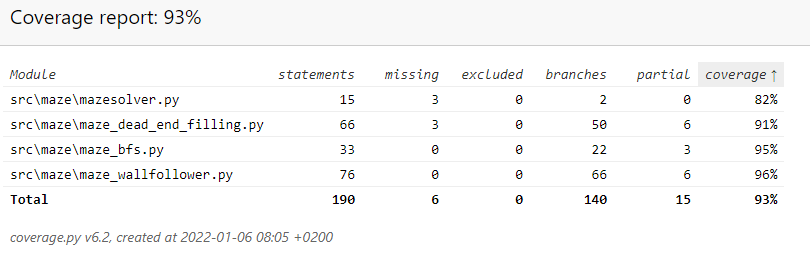
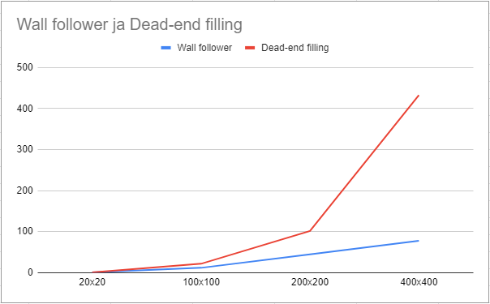

# Testausdokumentti

## Koodin testaus

  
*Pytestin kattavuusraportti*

Yksikkötestauksessa käytettiin pytestiä. Sovelluksen kaikki metodit ja luokat ovat testattu. Testaamatta on jätetty käyttöliittymästä vastaava index.py. Pytest tarkastaa algoritmien ja luokan MazeSolver toimivuuden. Githubin workflow olisi käytössä testeissä, jos se toimisi pyamaze kirjaston kanssa.

Koodinlaadun tarkastamiseen käytetty pylintiä. Pylintin tarkastus asetuksia on hieman muokattu, sieltä on poistettu turhat tarkastukset. Pylint antaa arvosanaksi 10.

## Algoritmien testaus

Pienen labyrintin ratkaisussa menee kaikilla algoritmeillä todella vähän aikaa, mutta suuremmilla labyrinteillä saadaa suuria aikaeroja. BFS on selkeästi hitaampi kuin molemmat algoritmit. Algoritmien nopeuden testaamisessa käytetään samaa labyrinttiä aina.

Ensimmäisenä esimerkkinä 20x20 labyrintin ratkaisut:
- Wall followerilla kului 0.9981 ms
- Dead-end fillingillä kului 0.9975 ms
- BFS kului 3.9936 ms

200x200 labyrintin ratkaisussa huomataan jo suuria eroja ajan kulumisessa:
- Wall followerilla kului 44.9 ms
- Dead-end fillingillä kului 101.9 ms
- BFS kului 31014.6 ms, eli 31 s

400x400 labyrintin ratkaisussa selvät erot:
- Wall followerilla kului 77.8 ms
- Dead-end fillingillä kului 432.7 ms
- BFS kului 533219.6 ms, eli 533 s, 8.88 min

  
*Kuvassa vertaillaa wall followerin ja dead-end fillingin aikoja*

Huomataan, että dead-end filling kasvaa exponentiaalisesti, kun wallfollower ei kasva. Tämä todennäköisesti tapahtuu, koska labyrintti on täydellinen, eli dead-end filling käy koko labyrintin läpi, kun wallfollower voi käydä vain toisella puolella labyrintistä. Huomataan myös, että leveyshaku on todella paljon hitaampi kuin kumpikaan, ei ollut edes järkevää lisätä samaan kaavioon, koska parhaimmillaan 400x400 labyrintissä se on yli 6000 kertaa suurempi arvo kuin wall followerin.
