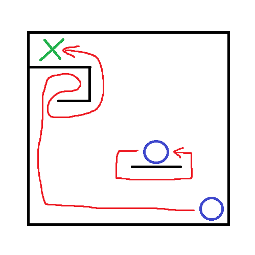
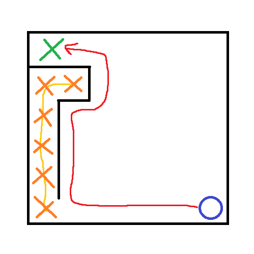

# Toteutusdokumentti
## Ohjelman yleisrakenne

Ohjelman suoritettava runko löytyy tiedostosta index.py.  

Itse algoritmit ja algoritmien logiikka on maze hakemistossa, joka sisältää luokan MazeSolver, 
joka vastaa labyrintin luomisesta, ja labyrintin ja algoritmien välisestä kommunikoinnista.

## Saavutetut aika- ja tilavaativuudet

### Wall follower

Käyttämällä wall follower / left hand rule algoritmiä päästään aina maaliin, paitsi jos labyrintissä on looppi kohdassa, josta labyrintti alkaa. Wall followerin aikavaativuuteen vaikuttaa siis todella paljon labyrintin muoto. Huonoimmassa tapauksessa, jossa labyrintti ratkeaa, aikavaativuus on O(n x m), jossa n ja m ovat labyrintin dimensiot, koska se joutuu käymään kaikki ruudut läpi. Parhaimmassa tapauksessa aikavaativuus on O(n + m), jossa n ja m ovat aloitus sijainnin ja maalin väliset x ja y etäisyydet, eli jos matkalla ei ole mutkia.

Aikavaativuus on O(n x m).

Algoritmin tilavaativuus on O(n). Talteen otetaan vain polku, joka kuljetaan.

  
*Kuvassa esitellään miten wall follower joutuu looppiin tai ratkeaa*

### Dead-end filling

Dead-end filling algoritmi käy ensin labyrintin läpi etsien umpikujat, jonka jälkee se täyttää löydetyt umpikujat, ja vasta sitten kulkee labyrintin läpi käyttämällä wall follower algoritmiä, jonka takia huonossa labyrintissä, se voi jäädä looppiin. Parhaimmassa tapauksessa ei ole umpikujia, eli ei tarvitse täyttää umpikujia, jolloin aikavaativuus olisi sama O(n + m), kuin wall followerin parhaassa tapauksessa. Huonoimmassa tapauksessa algoritmi löytää mahdollisimman monta umpikujaa, ja täyttää ne kaikki. Tämä tilanne tapahtuu, jos meillä on täydellinen labyrintti, eli meillä on vain yksi reitti. Huonoimmassa tapauksessa käydään läpi kaikki ruudut O(n x m) ja täytetään kaikki umpikujat, jäljelle jää vain yksi reitti. Täyttö ja kulkeminen tapahtuu ajassa O(n x m), kokonaisuudessa aikaa kuluu O(2(n x m)), eli parhaimmassa tapauksessa labyrintti ratkeaa ajassa O(n x m).

Aikavaativuus on O(n x m).

Tilavaativuus on O(n + m), n polun pituus ja m umpikujien määrä. Algoritmissä tallennetaan kuljettu polku ja löydetyt umpikujat. 

  
*Kuvassa esimerkki dead-end filling löytää umpikujan, kulkee sitä ja täyttää sen, sitten kuljetaan polku wall followerin avulla*

## Työn mahdolliset puutteet ja parannusehdotukset

Isoin parannus työhön olisi tehdä oma labyrintin luomis koodi. Käytän tässä työssä kirjastoa nimeltä pyamaze, joka käyttää tkinteriä, mutta sisältää turhia ja haittaavia ominaisuuksia tätä työtä varten. Pyamazen takia taustalla aina pyörii aina tkinter ikkuna, kun käyttää labyrintin ratkaisijaa.

Työhön voisi myös lisätä UI:n, jonka avulla saataisiin parempi käyttäjäkokemus. UI olisi ollut helppo lisätä, mutta aiemmin mainitun ongelman takia se on vaikeaa.

Dead-end filling algoritmissä voisi ehkä käyttää jotakin parempaa navigointi algoritmiä kuin wall follower.

## Lähteet
- [Wikipedia, Wall follower](https://en.wikipedia.org/wiki/Maze-solving_algorithm#Wall_follower)
- [Wikipedia, Dead-end filling](https://en.wikipedia.org/wiki/Maze-solving_algorithm#Dead-end_filling)
